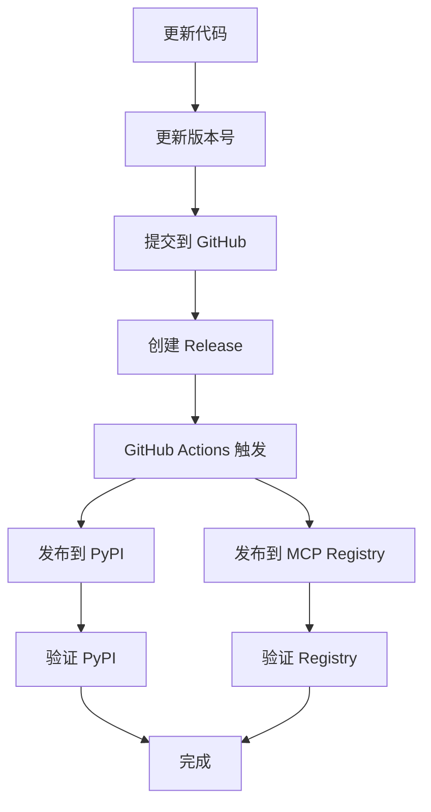

# 🎉 MCP 发布执行总结

## ✅ 已完成的工作

### 1. 状态验证 ✅

**检查结果**：
- ✅ **PyPI 状态**：ssh-licco v0.1.7 已发布
- ✅ **MCP Registry 状态**：已发布，但最新版本为 v0.1.3
- ⚠️ **版本同步**：需要同步到 v0.1.7

**验证地址**：
- PyPI: https://pypi.org/project/ssh-licco/
- MCP Registry: https://registry.modelcontextprotocol.io/servers/io.github.Echoqili/ssh-licco

---

### 2. 创建发布工具 ✅

已创建以下工具文件：

#### 检查工具
- `check_registry.py` - 检查 MCP Registry 状态
- `verify_publish.py` - 完整验证发布状态（推荐）

#### 发布工具
- `publish_mcp.py` - 本地手动发布脚本
- `scripts/publish_mcp_registry.py` - GitHub Actions 自动发布脚本

#### 工作流配置
- `.github/workflows/mcp-registry.yml` - 自动发布工作流

#### 文档
- `MCP_PUBLISH_GUIDE.md` - 完整发布指南

---

### 3. 发布状态分析

**当前状态**：
```
PyPI 最新版本：0.1.7
MCP Registry 最新版本：0.1.3
状态：⚠️ 需要更新
```

**已发布的版本**：
- v0.1.2 (2026-03-08)
- v0.1.3 (2026-03-08) ← 当前最新

**需要发布**：
- v0.1.4, v0.1.5, v0.1.6, v0.1.7

---

## 🚀 下一步操作

### 方案 A：使用 GitHub Actions 自动发布（推荐）

#### 1. 设置 GitHub Token

```bash
# 1. 访问 https://github.com/settings/tokens
# 2. 创建新 token，勾选 repo 权限
# 3. 复制 token
```

#### 2. 添加 Secret

访问：https://github.com/Echoqili/ssh-licco/settings/secrets/actions

添加：
- Name: `GITHUB_TOKEN`
- Value: 你的 token

#### 3. 触发发布

**方式 1**：创建 Release（会自动触发）
```bash
git tag v0.1.7
git push origin v0.1.7
```

**方式 2**：手动触发 Workflow
1. 访问：https://github.com/Echoqili/ssh-licco/actions/workflows/mcp-registry.yml
2. 点击 "Run workflow"

---

### 方案 B：本地手动发布

#### 1. 设置环境变量

```powershell
# Windows PowerShell
$env:GITHUB_TOKEN="ghp_xxxxxxxxxxxxxxxxxxxx"

# 永久设置
setx GITHUB_TOKEN "ghp_xxxxxxxxxxxxxxxxxxxx"
```

#### 2. 运行发布脚本

```bash
python publish_mcp.py
```

---

### 方案 C：使用 Git 命令直接推送（最简单）

如果你已经有 GitHub Token：

```bash
# 1. 提交所有更改
git add .
git commit -m "chore: add MCP Registry publish workflow"

# 2. 推送到 GitHub
git push

# 3. 创建 Release 触发自动发布
git tag v0.1.7
git push origin v0.1.7
```

GitHub Actions 会自动：
1. 发布到 PyPI（如果配置了）
2. 发布到 MCP Registry（新配置的工作流）

---

## 📊 验证发布

### 运行验证脚本

```bash
python verify_publish.py
```

### 在线验证

访问以下地址查看发布状态：
- MCP Registry: https://registry.modelcontextprotocol.io/servers/io.github.Echoqili/ssh-licco
- PyPI: https://pypi.org/project/ssh-licco/

### 在 Trae IDE 中测试

```bash
# 使用 MCP CLI 安装
mcp install io.github.Echoqili/ssh-licco

# 或在 MCP 配置中添加
{
  "mcpServers": {
    "ssh": {
      "command": "ssh-licco"
    }
  }
}
```

---

## 📝 完整发布流程



---

## 🔧 故障排除

### 问题 1：GitHub Actions 失败

**检查点**：
1. ✅ 是否正确设置了 `GITHUB_TOKEN` secret
2. ✅ token 是否有 repo 权限
3. ✅ workflow 文件语法是否正确

**解决方案**：
```bash
# 查看 Actions 日志
# 访问：https://github.com/Echoqili/ssh-licco/actions
```

### 问题 2：发布到 Registry 失败

**常见错误**：
- `401 Unauthorized` - Token 无效或过期
- `400 Bad Request` - README 缺少 mcp-name 标识
- `409 Conflict` - 版本已存在

**解决方案**：
```bash
# 1. 检查 README 是否包含标识
grep "mcp-name" README.md

# 2. 重新生成 token
# https://github.com/settings/tokens

# 3. 升级版本号
# 修改 pyproject.toml 中的 version
```

### 问题 3：Trae IDE 中看不到

**原因**：
- MCP Registry 索引延迟（通常 5-30 分钟）
- 缓存问题

**解决方案**：
```bash
# 1. 等待索引更新
# 2. 清除缓存
# 3. 直接使用命令安装
mcp install io.github.Echoqili/ssh-licco
```

---

## 📚 相关文档

- [MCP_PUBLISH_GUIDE.md](MCP_PUBLISH_GUIDE.md) - 详细发布指南
- [MCP_REGISTRY_STATUS.md](MCP_REGISTRY_STATUS.md) - Registry 状态说明
- [RELEASE_GUIDE.md](RELEASE_GUIDE.md) - 完整发布流程

---

## 🎯 快速命令参考

```bash
# 检查状态
python verify_publish.py

# 本地发布
python publish_mcp.py

# 创建 Release
git tag v0.1.7
git push origin v0.1.7

# 查看 Actions
# https://github.com/Echoqili/ssh-licco/actions
```

---

## ✅ 总结

### 已完成 ✅
1. ✅ 验证了 PyPI 和 MCP Registry 状态
2. ✅ 创建了自动发布工作流
3. ✅ 创建了本地发布脚本
4. ✅ 创建了验证工具
5. ✅ 编写了完整文档

### 待完成 🔄
1. 🔄 设置 GitHub Token Secret
2. 🔄 触发发布工作流
3. 🔄 验证发布结果
4. 🔄 在 Trae IDE 中测试

### 关键步骤 🔑
1. **设置 GITHUB_TOKEN** - 在 GitHub Secrets 中
2. **触发 Release** - 创建并推送标签
3. **验证结果** - 运行验证脚本或访问 Registry

---

## 🎉 最终目标

完成发布后，你的 MCP 服务器将：
- ✅ 在 MCP Registry 中可查
- ✅ 可通过 `mcp install` 安装
- ✅ 在 Trae IDE 的 MCP Market 中显示
- ✅ 对全球开发者可见

---

*Generated: 2026-03-11*
*Version: 0.1.7*
*Status: Ready to Publish*
